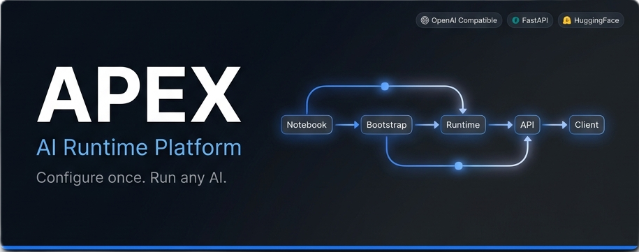

<div align="center">



<br/>

# APEX

### Adaptive Platform for Unified AI Configuration, Orchestration and Workspace Management

> *Configure once. Run any supported AI. Manage everything from one unified workspace.*

<br/>

[](https://github.com/Nikhil-Kumar-Shah/APEX/releases)
[](https://python.org)
[](LICENSE)
[](https://fastapi.tiangolo.com)
[](docs/API_REFERENCE.md)
[](https://huggingface.co)
[](https://colab.research.google.com/github/Nikhil-Kumar-Shah/APEX/blob/main/notebook/APEX.ipynb)
[](notebook/)
[](https://github.com/Nikhil-Kumar-Shah/APEX/actions)
[](docs/API_REFERENCE.md#streaming)

<br/>

[](https://colab.research.google.com/github/Nikhil-Kumar-Shah/APEX/blob/main/notebook/APEX.ipynb)

</div>

---

## 🚀 Launch APEX

The fastest path to a running AI runtime is a single click:

| | |
|---|---|
| [](https://colab.research.google.com/github/Nikhil-Kumar-Shah/APEX/blob/main/notebook/APEX.ipynb) | **[Open in Google Colab](https://colab.research.google.com/github/Nikhil-Kumar-Shah/APEX/blob/main/notebook/APEX.ipynb)** — Launch the full Developer Portal on a free T4 GPU in one click |
| 📖 | **[Quick Start Guide](#-quick-start)** — Google Colab or local Python setup |
| 📚 | **[Documentation Hub](#-documentation)** — Architecture, configuration, API reference |
| 🌐 | **[API Documentation](docs/API_REFERENCE.md)** — Endpoint catalogue with request/response examples |
| 💻 | **[Local Installation](#local-development)** — Run APEX on your own machine |
| ❤️ | **[Contributing Guide](CONTRIBUTING.md)** — Branch workflow, standards, PR process |

---

## Table of Contents

- [What is APEX?](#-what-is-apex)
- [Design Principles](#-design-principles)
- [Features](#-features)
- [Architecture](#️-architecture)
- [Repository Structure](#-repository-structure)
- [Quick Start](#-quick-start)
  - [Google Colab](#google-colab)
  - [Local Development](#local-development)
- [Notebook Collection](#-notebook-collection)
- [OpenAI Compatibility](#-openai-compatibility)
- [API Reference](#-api-reference)
- [Configuration](#️-configuration)
- [Supported Models](#-supported-models)
- [Documentation](#-documentation)
- [Roadmap](#️-roadmap)
- [Contributing](#-contributing)
- [Security](#-security)
- [Community & Support](#-community--support)
- [License](#-license)

---

## 🧠 What is APEX?

**APEX** is a modular, production-quality **AI Runtime Platform** that acts as a unified translation layer between open-source language models and the developer tools that consume them.

It provides a single, stable **OpenAI-compatible API** that sits in front of any inference backend — Hugging Face Transformers today, vLLM and llama.cpp tomorrow — so that clients like **Continue**, **Cline**, **Roo Code**, **Aider**, **Open WebUI**, and standard **OpenAI SDKs** connect without any modification.

APEX is not a model. It is not a fine-tuning tool. It is an **AI infrastructure platform** — the runtime, workspace, and API layer that everything else plugs into.

### Why APEX exists

Running open-source LLMs at development time is fragmented. Developers must juggle inference servers, adapters, configuration formats, authentication layers, workspace state, and client integrations — separately, for each tool and each model. APEX eliminates that fragmentation.

### Who it is for

| Audience | Use Case |
|---|---|
| **Individual Developers** | Run local models behind an OpenAI-compatible endpoint for any IDE extension |
| **Research Engineers** | Test multiple model backends through a single stable API |
| **Notebook Users** | Operate an entire AI runtime from a single Jupyter/Colab notebook |
| **Teams** | Shared workspace state, conversation history, and centralized configuration |

---

## 📐 Design Principles

| Principle | Description |
|---|---|
| **Notebook-First** | The primary interface is a Jupyter notebook. No separate CLI required. |
| **GitHub-First** | The runtime lives in a git repository. Updates are git pulls. Rollbacks are git checkouts. |
| **Workspace-First** | Every project gets an isolated workspace with its own history, index, and state. |
| **Configuration-First** | All runtime behaviour is driven by a single JSON config file. No hardcoded values. |
| **API-First** | Every capability is accessible through a stable, versioned HTTP API. |
| **Engine-Agnostic** | The API contract never changes when the inference backend changes. |
| **Developer-First** | Clear logs, structured errors, OpenAPI docs, and zero hidden behaviour. |
| **Modular** | Every subsystem (engine, workspace, API, UI) is independently replaceable. |
| **Portable** | Runs identically on Google Colab, a local GPU machine, or a remote server. |

---

## ✨ Features

### Runtime
- ✅ Fully **OpenAI-compatible REST API** (v1 endpoints)
- ✅ **Server-Sent Events** (SSE) streaming, identical to OpenAI's format
- ✅ Request queue with status tracking (`queued`, `running`, `completed`, `failed`)
- ✅ Runtime event lifecycle logging per request
- ✅ GPU / VRAM / CPU / RAM metrics captured per completion

### Models
- ✅ Hugging Face Transformers inference engine
- ✅ Pre-configured profiles for **Qwen**, **DeepSeek**, **Gemma**, **GLM**
- ✅ Model download and local cache management via `huggingface_hub`
- 🔜 vLLM PagedAttention backend *(planned v1.3)*
- 🔜 llama.cpp GGUF quantized inference *(planned v1.3)*
- 🔜 ONNX Runtime backend *(planned v2.0)*

### API
- ✅ `GET /v1/models` — list all loaded and available models
- ✅ `POST /v1/chat/completions` — OpenAI chat completions with streaming
- ✅ `POST /v1/completions` — legacy text completions
- ✅ `POST /v1/embeddings` — text embeddings
- ✅ `GET /health` — system health, uptime, GPU, queue status
- ✅ `GET /runtime` — VRAM, device, engine, precision details
- ✅ `GET /version` — runtime and API version
- ✅ `GET /` — developer landing page (HTML for browsers, JSON for API)
- ✅ `WebSocket /ws` — live streaming and event notifications
- 🔜 `POST /v1/images/*` — image generation *(schema ready)*
- 🔜 `POST /v1/audio/*` — speech and transcription *(schema ready)*
- 🔜 `POST /v1/files` — file management *(planned)*

### Workspace
- ✅ **Google Drive** persistence — workspace survives Colab session resets
- ✅ Conversation history logging (JSON format)
- ✅ AST-based repository and codebase symbol indexer
- ✅ Workspace isolation — multiple independent project contexts
- ✅ Configuration schema versioning and automatic migration

### Developer Experience
- ✅ **Interactive Documentation Center** — browse all docs from inside the notebook
- ✅ **Bootstrap installer** — one-cell setup on a fresh Colab instance
- ✅ Automatic dependency resolution and validation
- ✅ Git tag-based version management and hot-switching
- ✅ Structured, colour-coded terminal logging
- ✅ Auto-generated **OpenAPI / Swagger** documentation at `/docs`
- ✅ Bearer token and API key authentication
- ✅ Cloudflare Tunnel / ngrok support for remote HTTPS access

### Notebook Interface
- ✅ **9-section Developer Portal** notebook with clear separation of concerns
- ✅ Lightweight `ipywidgets` Live Status Dashboard
- ✅ Full-text documentation search inside the notebook
- ✅ System info panel: git status, GPU, VRAM, Python version

---

## 🏗️ Architecture

APEX enforces a strict layered architecture. Each layer communicates only with the layer directly below it. The API never loads models. The notebook never touches inference directly.

```
┌─────────────────────────────────────────────────────────┐
│                      CLIENT LAYER                        │
│   Continue · Cline · Aider · Open WebUI · OpenAI SDK    │
└────────────────────────┬────────────────────────────────┘
                         │  HTTP / WebSocket / SSE
┌────────────────────────▼────────────────────────────────┐
│               OPENAI-COMPATIBLE API LAYER                │
│  Authentication → Validation → Router → Serializer       │
│  /v1/chat/completions · /v1/models · /v1/embeddings      │
└────────────────────────┬────────────────────────────────┘
                         │  Internal Python calls
┌────────────────────────▼────────────────────────────────┐
│                   REQUEST PIPELINE                        │
│  Queue → Events → Context Builder → Tokenizer            │
└────────────────────────┬────────────────────────────────┘
                         │
┌────────────────────────▼────────────────────────────────┐
│                    RUNTIME CORE                           │
│  Orchestrator → Model Manager → Workspace Manager        │
└──────────┬─────────────┬───────────────┬────────────────┘
           │             │               │
┌──────────▼──┐  ┌───────▼────┐  ┌──────▼──────────────┐
│  INFERENCE  │  │  WORKSPACE  │  │   CONFIGURATION     │
│  ENGINE     │  │  MEMORY     │  │   & PERSISTENCE     │
│             │  │             │  │                     │
│ Transformers│  │ JSON / Drive│  │ apex.config.json    │
│ (vLLM soon) │  │ Google Drive│  │ Schema Migrations   │
└──────────┬──┘  └─────────────┘  └─────────────────────┘
           │
┌──────────▼──────────┐
│   LOADED MODEL      │
│   (GPU / CPU)       │
└─────────────────────┘
```

**Notebook → Runtime flow:**

```
notebook/APEX.ipynb
       │
       ▼
  BOOTSTRAP        ← git clone/pull, pip install, config validate, Drive mount
       │
       ▼
  RUNTIME CORE     ← orchestrates all subsystems
  ┌────┴──────────────────────────────────────┐
  │  API Server  │  Model Manager  │  Workspace │
  └─────────────────────────────────────────────┘
       │
       ▼
  TUNNEL (ngrok / Cloudflare) ← public HTTPS endpoint
       │
       ▼
  IDE EXTENSIONS / SDKs / WEB CLIENTS
```

---

## 📁 Repository Structure

```
APEX/
│
├── 📓 notebook/
│   ├── APEX.ipynb              # Primary entry point — the Developer Portal
│   └── generate_notebook.py   # Regenerates APEX.ipynb from source (maintainers)
│
├── 🚀 bootstrap/               # Deployment & environment management
│   ├── installer.py            # Interactive setup wizard
│   ├── launcher.py             # Runtime path configuration and launch
│   ├── dependency_manager.py   # Automated pip dependency resolution
│   ├── repository_manager.py   # Git clone/pull operations
│   ├── version_manager.py      # Git tag management, dev mode fallback
│   ├── migration.py            # Config schema migrations with backup
│   ├── validator.py            # Manifest-based structural validation
│   └── diagnostics.py         # Environment health diagnostics
│
├── ⚙️ runtime/                 # Core application runtime
│   ├── api/                    # OpenAI-compatible HTTP API (FastAPI)
│   │   ├── router.py           # Central router — aggregates all sub-routers
│   │   ├── server.py           # FastAPI app factory and middleware
│   │   ├── chat.py             # POST /v1/chat/completions
│   │   ├── models.py           # GET /v1/models
│   │   ├── completion.py       # POST /v1/completions
│   │   ├── embeddings.py       # POST /v1/embeddings
│   │   ├── health.py           # GET /health
│   │   ├── runtime.py          # GET /runtime
│   │   ├── version.py          # GET /version
│   │   ├── streaming.py        # SSE streaming utilities
│   │   ├── serializers.py      # OpenAI response format builders
│   │   ├── errors.py           # Standardised OpenAI error responses
│   │   ├── events.py           # Request lifecycle event tracking
│   │   ├── metrics.py          # Per-request latency, token, GPU metrics
│   │   ├── authentication.py   # Bearer token / API key auth
│   │   ├── middleware.py       # CORS, request logging
│   │   ├── websocket.py        # WebSocket endpoint /ws
│   │   ├── schemas.py          # Pydantic request/response schemas
│   │   ├── queue.py            # Request queue management
│   │   ├── security.py         # Exception handler, secret protection
│   │   ├── images.py           # POST /v1/images/* (501 stub)
│   │   ├── audio.py            # POST /v1/audio/* (501 stub)
│   │   ├── files.py            # POST /v1/files (501 stub)
│   │   ├── vision.py           # POST /v1/vision (501 stub)
│   │   └── responses.py        # POST /v1/responses (501 stub)
│   │
│   ├── engine/                 # Inference engine abstraction layer
│   ├── model/                  # Model manager, downloader, cache
│   ├── core/                   # Health checks, lifecycle, exceptions
│   ├── config/                 # Config schema, loader, validator
│   ├── memory/                 # Workspace state, conversation history
│   ├── drive/                  # Google Drive integration
│   ├── logging/                # Structured, colour-coded logging
│   ├── ui/                     # ipywidgets dashboard + Documentation Center
│   ├── orchestrator/           # Runtime coordinator
│   └── utils/                  # Shared utilities
│
├── 🧪 tests/                   # Test suite (pytest)
├── 📖 docs/                    # Architecture and developer documentation
├── 💡 examples/                # Example configuration files
├── 🖼️ assets/                  # Banner, architecture diagrams, screenshots
├── 🗂️ workspaces/              # Workspace state (git-ignored)
│
├── README.md
├── CONTRIBUTING.md
├── SECURITY.md
├── SUPPORT.md
├── CHANGELOG.md
├── CODE_OF_CONDUCT.md
├── LICENSE
├── pyproject.toml
└── requirements.txt
```

---

## 🚀 Quick Start

### Google Colab

The fastest way to run APEX. No local setup required. Free T4 GPU included.

**Step 1 — Open the notebook (one click):**

[](https://colab.research.google.com/github/Nikhil-Kumar-Shah/APEX/blob/main/notebook/APEX.ipynb)

**Step 2 — Run Section 0 (Welcome):**

The first code cell in the notebook automatically:
- Mounts Google Drive for persistent storage
- Clones or updates the APEX repository from GitHub
- Configures `sys.path`
- Displays the welcome screen and project information panel

**Step 3 — Set your model (Section 2 — Configuration):**

```python
MODEL_ID  = "Qwen/Qwen2.5-7B-Instruct"
PRECISION = "float16"
TRANSPORT = "cloudflare"
```

**Step 4 — Run Sections 3 → 6 sequentially:**

| Section | Action |
|---|---|
| 3 — Initialize Runtime | Boot lifecycle, managers, dashboard |
| 4 — Model Management | Download → Load into VRAM |
| 5 — API Server | Start FastAPI + Cloudflare tunnel |
| Done | Copy the tunnel URL from the output |

**Step 5 — Connect your IDE:**

```
Base URL:  https://your-tunnel.trycloudflare.com/v1
API Key:   any-string (or your configured key)
Model:     apex-runtime-model
```

---

### Local Development

**Prerequisites:** Python 3.10+, Git, CUDA drivers (optional — CPU inference works)

```bash
# 1. Clone the repository
git clone https://github.com/Nikhil-Kumar-Shah/APEX.git
cd APEX

# 2. Install with development and ML extras
pip install -e ".[dev,ml]"

# 3. Run the test suite
pytest tests/ -v

# 4. Start the API server
python -m runtime.api.server
```

The API will be available at `http://localhost:8000`.
OpenAPI documentation at `http://localhost:8000/docs`.

---

## 📓 Notebook Collection

APEX is designed around an expanding set of focused notebooks. All notebooks run in Google Colab without local setup.

| Notebook | Status | Description |
|---|---|---|
| **[APEX.ipynb](notebook/APEX.ipynb)** | ✅ Available | Main Developer Portal — 9-section runtime control surface |
| **Quick_Start.ipynb** | 🔜 Planned | Minimal notebook: download, load, start in under 5 minutes |
| **API_Demo.ipynb** | 🔜 Planned | OpenAI-compatible API usage examples (Python + JS SDKs) |
| **Model_Management.ipynb** | 🔜 Planned | Downloading, loading, comparing, and benchmarking models |
| **Continue_Setup.ipynb** | 🔜 Planned | Step-by-step Continue IDE extension integration guide |
| **Cline_Setup.ipynb** | 🔜 Planned | Step-by-step Cline VS Code extension integration guide |
| **Benchmark.ipynb** | 🔜 Planned | Runtime benchmarking — tokens/sec, latency, throughput |

### The APEX.ipynb Developer Portal

The primary notebook (`notebook/APEX.ipynb`) is structured as a **9-section developer portal**, not a single sequential script:

| # | Section | Purpose |
|---|---|---|
| 0 | 🌟 Welcome | Drive mount, git pull, welcome screen, system info panel |
| 1 | 📚 Documentation Center | Interactive full-text documentation browser and search |
| 2 | ⚙️ Configuration | `MODEL_ID`, `PRECISION`, `TRANSPORT`, `AUTHENTICATION` variables |
| 3 | 🚀 Initialize Runtime | Boot lifecycle, managers, Live Status Dashboard |
| 4 | 📥 Model Management | Download weights → Load into VRAM (separate cells) |
| 5 | 🌐 API Server | Start the OpenAI-compatible API + tunnel |
| 6 | 🗂️ Workspace | Create, list, and switch project workspaces |
| 7 | 🔬 Diagnostics | Health report, git status, GPU metrics |
| 8 | 🛑 Shutdown | Graceful model unload and server stop |

The **Documentation Center** (Section 1) provides interactive access to all project documentation directly inside Colab — no GitHub visit required. It auto-discovers new files added to `docs/` and supports full-text search across the entire documentation set.

---

## 🔌 OpenAI Compatibility

APEX implements the OpenAI API specification. Any client that supports a custom `base_url` will work without modification.

### Supported Clients

| Client | Status | Configuration |
|---|---|---|
| **Continue** | ✅ Compatible | `provider: openai`, `apiBase: <tunnel-url>/v1` |
| **Cline** | ✅ Compatible | OpenAI provider, custom base URL |
| **Roo Code** | ✅ Compatible | OpenAI provider, custom base URL |
| **Aider** | ✅ Compatible | `--openai-api-base <tunnel-url>/v1` |
| **Open WebUI** | ✅ Compatible | OpenAI API, custom base URL |
| **LangChain** | ✅ Compatible | `ChatOpenAI(base_url=..., api_key=...)` |
| **LlamaIndex** | ✅ Compatible | `OpenAI(api_base=..., api_key=...)` |
| **OpenAI Python SDK** | ✅ Compatible | `OpenAI(base_url=..., api_key=...)` |
| **OpenAI JS SDK** | ✅ Compatible | `new OpenAI({ baseURL: ..., apiKey: ... })` |
| **Cursor** | ✅ Compatible | Custom OpenAI endpoint setting |
| **Windsurf** | ✅ Compatible | Custom OpenAI endpoint setting |

### Python SDK Example

```python
from openai import OpenAI

client = OpenAI(
    base_url="https://your-tunnel.trycloudflare.com/v1",
    api_key="apex-key"  # any string if auth is disabled
)

response = client.chat.completions.create(
    model="apex-runtime-model",
    messages=[{"role": "user", "content": "Hello, APEX!"}],
    stream=True
)

for chunk in response:
    print(chunk.choices[0].delta.content or "", end="")
```

### JavaScript SDK Example

```javascript
import OpenAI from "openai";

const client = new OpenAI({
  baseURL: "https://your-tunnel.trycloudflare.com/v1",
  apiKey: "apex-key",
});

const stream = await client.chat.completions.create({
  model: "apex-runtime-model",
  messages: [{ role: "user", content: "Hello, APEX!" }],
  stream: true,
});

for await (const chunk of stream) {
  process.stdout.write(chunk.choices[0]?.delta?.content || "");
}
```

---

## 📡 API Reference

Full documentation: **[docs/API_REFERENCE.md](docs/API_REFERENCE.md)**

### Implemented Endpoints

| Method | Endpoint | Description |
|---|---|---|
| `GET` | `/` | Developer landing page (HTML for browsers, JSON for API clients) |
| `GET` | `/health` | System health: uptime, GPU, memory, queue, worker status |
| `GET` | `/runtime` | Runtime details: model, VRAM, device, engine, precision |
| `GET` | `/version` | Runtime version, API version, build, compatibility |
| `GET` | `/v1/models` | List all loaded and available models |
| `GET` | `/v1/models/{id}` | Get details for a specific model |
| `POST` | `/v1/chat/completions` | Chat completions — streaming and non-streaming |
| `POST` | `/v1/completions` | Classic text completions |
| `POST` | `/v1/embeddings` | Text embeddings |
| `WS` | `/ws` | WebSocket — streaming, events, queue notifications |

### Planned Endpoints (501 — Schema Ready)

| Method | Endpoint | Target |
|---|---|---|
| `POST` | `/v1/images/generations` | v1.4 |
| `POST` | `/v1/images/edits` | v1.4 |
| `POST` | `/v1/audio/transcriptions` | v1.4 |
| `POST` | `/v1/audio/speech` | v1.4 |
| `POST` | `/v1/files` | v1.4 |
| `POST` | `/v1/responses` | v1.4 |
| `POST` | `/v1/vision` | v2.0 |

---

## ⚙️ Configuration

Configuration lives in `configs/apex.config.json`. APEX validates this file on startup and migrates it automatically between schema versions.

```json
{
  "project_id": "my-workspace",
  "project_name": "My APEX Workspace",
  "runtime_version": "1.2.0",
  "config_version": "1.0",
  "model": {
    "id": "Qwen/Qwen2.5-7B-Instruct",
    "precision": "bf16",
    "device": "cuda"
  },
  "api": {
    "host": "0.0.0.0",
    "port": 8000,
    "enable_auth": false,
    "enable_request_logs": true
  },
  "workspace": {
    "persistence": "google_drive",
    "drive_path": "/content/drive/MyDrive/APEX"
  }
}
```

Full configuration reference: **[docs/CONFIGURATION.md](docs/CONFIGURATION.md)**

---

## 🤖 Supported Models

APEX is engine-agnostic. Any model loadable by Hugging Face Transformers works out of the box. Pre-tested model profiles:

| Model | Parameters | Context | Best For |
|---|---|---|---|
| `Qwen/Qwen2.5-7B-Instruct` | 7B | 32K | General coding, instruction following |
| `Qwen/Qwen2.5-Coder-7B-Instruct` | 7B | 32K | Code generation, autocomplete |
| `deepseek-ai/DeepSeek-Coder-6.7B-Instruct` | 6.7B | 16K | Code-focused tasks |
| `google/gemma-2-9b-it` | 9B | 8K | Balanced instruction following |
| `THUDM/glm-4-9b-chat` | 9B | 128K | Chat, multilingual |

---

## 📖 Documentation

| Document | Description |
|---|---|
| [Installation Guide](docs/INSTALLATION.md) | Google Colab and local Python setup |
| [Configuration Guide](docs/CONFIGURATION.md) | All config fields and environment variables |
| [API Reference](docs/API_REFERENCE.md) | Complete endpoint docs with request/response examples |
| [Developer Guide](docs/DEVELOPER_GUIDE.md) | Architecture, lifecycle, coding conventions, testing |
| [Model Runtime Architecture](docs/Model_Runtime_Architecture.md) | Inference engine and model manager design |
| [Server API Architecture](docs/Server_API_Architecture.md) | API pipeline, middleware, routing internals |
| [Memory Workspace Architecture](docs/Memory_Workspace_Architecture.md) | Workspace isolation and Google Drive persistence |
| [User Interface Architecture](docs/User_Interface_Architecture.md) | Notebook dashboard design |
| [Release Process](docs/RELEASE_PROCESS.md) | Versioning, tagging, and release SOP |
| [Changelog](CHANGELOG.md) | Full version history |
| [Security Policy](SECURITY.md) | Authentication, HTTPS, responsible disclosure |
| [Contributing Guide](CONTRIBUTING.md) | Setup, standards, PR workflow |
| [Support](SUPPORT.md) | Where to get help |

---

## 🗺️ Roadmap

| Feature | Status | Target |
|---|---|---|
| Hugging Face Transformers backend | ✅ Implemented | v1.0 |
| OpenAI-compatible chat completions | ✅ Implemented | v1.0 |
| SSE streaming | ✅ Implemented | v1.0 |
| Google Drive persistence | ✅ Implemented | v1.0 |
| Modular API architecture | ✅ Implemented | v1.2 |
| Request queue & event lifecycle | ✅ Implemented | v1.2 |
| WebSocket streaming | ✅ Implemented | v1.2 |
| Bearer token authentication | ✅ Implemented | v1.2 |
| Interactive Documentation Center | ✅ Implemented | v1.2 |
| 9-section Developer Portal notebook | ✅ Implemented | v1.2 |
| vLLM inference backend | 🔜 Planned | v1.3 |
| llama.cpp GGUF backend | 🔜 Planned | v1.3 |
| Docker container image | 🔜 Planned | v1.3 |
| PyPI package release | 🔜 Planned | v1.3 |
| Image generation endpoints | 🔜 Planned | v1.4 |
| Audio transcription endpoints | 🔜 Planned | v1.4 |
| File upload and management | 🔜 Planned | v1.4 |
| Vision / multimodal input | 🔜 Planned | v2.0 |
| ACRS (Advanced Custom Runtime System) | 🔜 Planned | v2.0 |

---

## 🤝 Contributing

Contributions are welcome and appreciated. APEX is designed to be extended.

See **[CONTRIBUTING.md](CONTRIBUTING.md)** for the complete guide, including coding standards, branch naming, Conventional Commits, and the PR review process.

```bash
# Fork → Clone → Install
git clone https://github.com/YOUR_USERNAME/APEX.git
cd APEX
pip install -e ".[dev,ml]"

# Create a feature branch
git checkout -b feat/my-feature

# Make changes, run tests
pytest tests/ -v

# Commit using Conventional Commits format
git commit -m "feat: add vLLM inference backend adapter"

# Push and open a Pull Request targeting the dev branch
git push origin feat/my-feature
```

---

## 🔒 Security

APEX exposes a network API. Please read **[SECURITY.md](SECURITY.md)** before deploying publicly.

**Key requirements before exposing a public tunnel:**
- Enable `enable_auth: true` and set a strong `api_key`
- Use Cloudflare Tunnel or ngrok — never expose plain HTTP
- Never commit API keys, HuggingFace tokens, or tunnel auth tokens

**Report vulnerabilities privately** via [https://www.nikhilkshah.me/contact](https://www.nikhilkshah.me/contact) — do not open public issues for security problems.

---

## 💬 Community & Support

| Channel | Purpose |
|---|---|
| [GitHub Issues](https://github.com/Nikhil-Kumar-Shah/APEX/issues) | Bug reports and confirmed problems |
| [GitHub Discussions](https://github.com/Nikhil-Kumar-Shah/APEX/discussions) | Questions, ideas, show and tell |
| [SUPPORT.md](SUPPORT.md) | Detailed support routing guide |
| [Security Contact](https://www.nikhilkshah.me/contact) | Private vulnerability reports |

---

## 📄 License

Distributed under the **MIT License**. See [LICENSE](LICENSE) for full terms.

---

<div align="center">

Built with ❤️ by [Nikhil Kumar Shah](https://www.nikhilkshah.me) and contributors.

*APEX — Configure once. Run any supported AI. Manage everything from one unified workspace.*

[](https://colab.research.google.com/github/Nikhil-Kumar-Shah/APEX/blob/main/notebook/APEX.ipynb)

</div>
